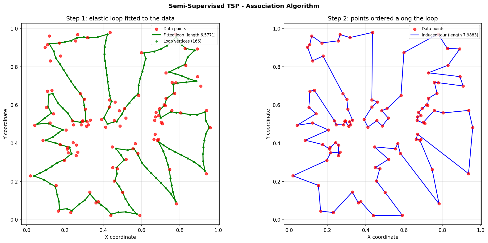

# Semi-Supervised TSP Visualizer

An interactive tool for solving and visualising the Traveling Salesman Problem
with six algorithms, including a semi-supervised "elastic loop" approach that
fits a continuous curve to the data and reads the tour off it.



## The idea

Most TSP heuristics search directly over permutations of the cities. The
association solver in this project does something different: it fits a closed
elastic loop to the point cloud, the way a self-organising map fits a manifold.

1. Start with a noisy circle of vertices.
2. Assign every data point to its nearest loop vertex.
3. Pull each vertex toward the centroid of the points that chose it.
4. Relax the loop with curvature-aware Laplacian smoothing.
5. Repeat, decaying both the attraction and the smoothing.

The result is a smooth curve threading the data (left panel above). Ordering
the data points by where they project onto that curve turns it into a genuine
tour that visits every point exactly once (right panel).

**The distinction matters for measurement.** The fitted loop is *shorter* than
any tour of the points, because it does not have to pass through them — it just
has to run near them. Reporting the loop's length as if it were a tour length
would flatter the loop-based solvers against every other algorithm. So each
solver exposes two things:

- `solve_loop(points)` — the geometry to draw.
- `solve_tour(points)` — an ordering of the input point indices.

Comparisons always score `solve_tour`, so all six algorithms are measured on
the same quantity.

## Algorithms

| Algorithm | Approach |
|-----------|----------|
| `nearest_neighbor` | Greedy construction; the baseline everything else is measured against |
| `two_opt` | Greedy start, then 2-opt segment reversals with delta evaluation |
| `genetic` | Order crossover (OX) and swap mutation over a population of tours |
| `simulated_annealing` | 2-opt reversal proposals with a temperature calibrated to the data |
| `association` | Elastic loop fitted to the data, tour read off by projection |
| `clustering` | k-means centres ordered greedily, resampled into a finer loop |

### Measured performance

Mean over three seeds at 200 points, as a percentage of the greedy
nearest-neighbour tour length (lower is better). Reproduce with
`python cli.py compare <algorithms> --points 200`.

| Algorithm | Tour vs greedy | Time (200 pts) |
|-----------|---------------:|---------------:|
| `two_opt` | 83% | 0.09s |
| `simulated_annealing` | 85% | 5.01s |
| `association` | 89% | 0.27s |
| `clustering` | 99% | 0.14s |
| `nearest_neighbor` | 100% | 0.00s |
| `genetic` | 100% | 0.32s |

Two honest notes on these numbers:

- **`genetic` does not currently beat greedy.** Plain OX crossover with heavy
  elitism converges prematurely; raising the generation count to 500 only
  reaches ~97%. It needs a better local-search hybrid to be competitive.
- **`association` is not the fastest route to a short tour** — `two_opt` is
  both quicker and shorter. Its appeal is that the intermediate states are a
  smooth, continuously deforming curve, which is what makes it worth watching.

Any tour can be polished afterwards with `--refine`, which applies 2-opt to the
result. That brings `association` to roughly the same quality as `two_opt`.

## Installation

Python 3.8 or newer.

```bash
git clone https://github.com/SdSarthak/Semi-Supervised-TSP.git
cd Semi-Supervised-TSP

python -m venv venv
source venv/bin/activate        # Windows: venv\Scripts\activate

pip install -r requirements.txt
```

For the test suite and linter:

```bash
pip install -r requirements-dev.txt
```

### Data

There is no dataset to download. Point sets are generated on demand — a mix of
Gaussian clusters and uniform noise in the unit square — and are reproducible
from a seed:

```bash
python cli.py generate --points 200 --output points.json
```

You can also bring your own points as a JSON file (`{"points": [[x, y], ...]}`),
a two-column CSV, or a whitespace-delimited text file, and pass it with
`--input`.

### Optional: video export

Saving an animation as MP4 requires **ffmpeg** on your `PATH`. Without it, use a
`.gif` filename and matplotlib falls back to its bundled Pillow writer.

## Usage

### Quick start

```bash
# Solve and plot
python main.py --algorithm association --points 200

# Compare every algorithm on the same points
python main.py --compare nearest_neighbor two_opt association clustering --points 200

# Interactive GUI
python main.py --mode gui
```

### Command line

```bash
# Solve with a specific algorithm and save the result
python cli.py solve association --points 200 --output solution.json

# Compare, several runs each to expose the spread of the stochastic solvers
python cli.py compare nearest_neighbor two_opt genetic --points 100 --runs 5

# Polish every tour with 2-opt before reporting
python cli.py --refine compare association clustering --points 200

# Benchmark across problem sizes, writing the numbers out as JSON
python cli.py benchmark nearest_neighbor two_opt --sizes 50 100 200 --output bench.json

# Render an animation
python cli.py animate association --points 150 --output animation.mp4
```

`main.py --mode cli` forwards everything after it to the same interface, so
`python main.py --mode cli solve two_opt --points 40` works too.

### Python API

```python
from algorithms import get_algorithm
from utils import generate_clustered_points

points = generate_clustered_points(200, n_clusters=5, seed=42)

solver = get_algorithm('association', n_vertices=80, seed=42)
solution = solver.evaluate(points, refine=True)

solution.tour          # ordering of point indices
solution.tour_points   # the points in visiting order
solution.length        # tour length over all points
solution.loop          # the fitted loop, for plotting
solution.loop_length   # loop length (shorter -- it need not pass through points)
solution.runtime
```

### Headless machines

Nothing imports a GUI toolkit at import time. The matplotlib backend is chosen
when something actually draws, falling back to the non-interactive `Agg`
writer, so `cli.py`, the test suite and the demo all run over SSH or in CI. Set
`MPLBACKEND=Agg` to skip the toolkit probe entirely.

## Configuration

`config.py` holds the defaults. Three settings can be overridden through the
environment (see `.env.example`):

| Variable | Meaning |
|----------|---------|
| `TSP_SEED` | Default seed for data generation and the stochastic solvers |
| `TSP_EXPORT_DIR` | Where solutions, plots and videos are written |
| `MPLBACKEND` | Matplotlib backend override |

Notable algorithm parameters:

```python
class Config:
    N_VERTICES = 120            # loop resolution for the association solver
    INITIAL_MOVE_RATE = 0.25    # attraction toward assigned centroids
    INITIAL_SMOOTH_RATE = 0.4   # Laplacian smoothing strength
    MIN_SMOOTH_RATE = 0.0       # smoothing must decay for the loop to sharpen
    STEPS = 600                 # association iterations / animation frames

    SA_INITIAL_TEMP = None      # None calibrates the schedule to the data
```

`SA_INITIAL_TEMP = None` is deliberate. A fixed temperature is meaningless
without knowing the coordinate scale: on the unit square a tour edge is about
0.05 long, so the old default of 1000 accepted every proposal and turned
annealing into a random walk. Left as `None`, the solver anchors the starting
temperature to the mean edge length of its initial tour.

## Testing

```bash
python -m pytest              # or: python test_suite.py
```

82 tests, all deterministic and offline — no dataset download, no display
required. They cover:

- Loop projection and the tour it induces
- 2-opt refinement (never lengthens a tour; untangles a crossed one)
- The contract that every solver returns a valid permutation of the points
- Reproducibility from a fixed seed
- Config validation and JSON/CSV round trips
- End-to-end runs of every CLI subcommand

## Project structure

```
├── config.py            # Configuration and validation
├── backend.py           # Matplotlib backend selection
├── utils.py             # Geometry, projection, refinement, file IO
├── algorithms.py        # The six solvers and the shared solver interface
├── main.py              # Simple mode entry point
├── cli.py               # Batch interface (solve/compare/animate/benchmark)
├── gui.py               # Interactive matplotlib GUI
├── demo.py              # Generates the plot at the top of this README
├── test_suite.py        # Config, utility and algorithm tests
├── test_tours.py        # Tour construction and solver contract tests
└── test_interfaces.py   # CLI, config and file IO tests
```

### Adding an algorithm

1. Subclass `TSPAlgorithm` in `algorithms.py`.
2. Implement `solve_tour(points)` returning an ordering of point indices.
3. If it fits a curve rather than permuting points, also set
   `produces_loop = True` and implement `solve_loop(points)`.
4. Register it in the `ALGORITHMS` dict and add it to
   `Config.AVAILABLE_ALGORITHMS`.
5. It is then covered automatically by the contract tests in `test_tours.py`.

## Known limitations

- The genetic algorithm does not beat greedy construction (see above).
- The association solver's tour quality is sensitive to the vertex count;
  roughly one vertex per data point works best, and more vertices makes it
  worse rather than better.
- `simulated_annealing` is the slowest solver by an order of magnitude because
  its schedule is a fixed number of temperature steps regardless of problem
  size.

## References

- [Traveling Salesman Problem](https://en.wikipedia.org/wiki/Travelling_salesman_problem)
- Durbin & Willshaw (1987), *An analogue approach to the travelling salesman
  problem using an elastic net method* — the origin of the loop-fitting idea
- [2-opt](https://en.wikipedia.org/wiki/2-opt)
- [Simulated annealing](https://en.wikipedia.org/wiki/Simulated_annealing)

## License

MIT
